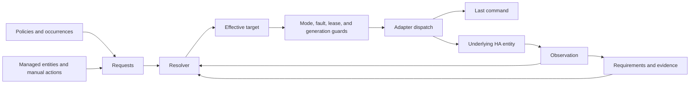

# Architecture

This document defines the approved architecture for the
[baseline alignment](baseline-alignment.md). Implementation and validation are
tracked separately; this contract does not establish release readiness.

HA Operator coordinates desired state inside Home Assistant. Native config
subentries define resources, policies, requirements, and desired controls. Managed entities accept
commands, while adapters observe and control the underlying entities. The
simulator belongs only to the test lab and is excluded from the release archive.

## Four distinct states

| State | Meaning | Example |
| --- | --- | --- |
| Request | A source's desired outcome, validity, and ownership. | A ventilation policy requests position 40. |
| Effective target | The resolver's selected target after priority, leases, restrictions, and requirements. | A manual lease selects position 20. |
| Last command | The most recent dispatched attempt, with its request generation and timing. | Position 20 was sent at a recorded timestamp. |
| Observation | The underlying entity's reported position, power, direction, availability, or movement. | The window still reports position 0. |

A successful service call records an attempt; it does not replace the observation.
A managed cover's position comes from the raw cover, not from its requested
position. Derived helpers that read virtual targets do not provide physical
confirmation.

## Configuration and resolution

A singleton config entry contains native `resource`, `policy`, `requirement`, and `intent`
subentries. HA-generated subentry IDs are the references between them. Entities
belong to their subentry and have stable unique IDs. Resource mode is an
`observe` or `live` select; a custom global service interceptor is not used.
Home Assistant provides a
[native config-entry and subentry lifecycle](https://developers.home-assistant.io/docs/config_entries_index/).

Observe mode rejects new manual requests and occurrence submissions. It preserves
existing intent for inspection while suppressing all actuation, including
STOP. Explicit skips can still consume an occurrence without dispatching it.

Native subentry deletion does not protect references from policies or
requirements. Delete or reconfigure dependents before removing their resource.
If a deletion leaves an invalid graph, preserve the remaining configuration,
stop the old runtime, and expose a setup error and actionable Repair. Correct
the dependent entries, then use native Reload if setup has not resumed. A
process restart and silent cascade deletion are unnecessary. This is an
integration policy; HA's [native delete endpoint](https://github.com/home-assistant/core/blob/2026.9.3/homeassistant/components/config/config_entries.py#L828-L857)
does not supply a dependency veto.

The resolver gives valid manual leases priority over requirements, then ordinary
policies. Policies retain their own intent when they lose arbitration. Removing
one source does not issue an unconditional device-off request or erase another
source's demand. A target is normalized against the adapter's actual capabilities
before dispatch.

With no valid request, a resource becomes idle and leaves the actuator in its
observed state. `default_target` normalizes commands such as fan turn-on; it does
not provide an idle fallback. Add an ordinary baseline policy when ending a
requirement or manual lease must return the resource to a particular target.

State policies derive eligibility and, optionally, a target from entity state or
an attribute. Attribute changes must trigger reevaluation even when the entity's
state string stays unchanged. Occurrence policies receive an explicit occurrence
ID and expiry. Reusing an ID does not create a second occurrence. A skipped or
expired occurrence stays consumed. Disabling a policy discards its pending
occurrences without disabling future occurrences after reenablement.

## Manual control and STOP

A target lease supplies a manual target until its deadline or explicit release.
A hands-off lease suppresses dispatch without replacing the policy requests.
Leases can be finite or explicitly indefinite. Expiry and release reevaluate
current intent rather than restoring a cached command.

Managed commands and explicit integration actions establish ownership. Raw
telemetry does not establish that a person acted. Context IDs can help explain
an event chain, but a missing user or parent ID is not proof of a manual action.
External control routes need an explicit, trustworthy event-to-request mapping.

STOP is advertised only when the ultimate actuator supports it. In Home Assistant
2026.9.3, cover features `7` mean open, close, and set position; STOP requires bit
`8`. A virtual cover advertising `15` does not change a raw cover's contract.
Setting the target to the reported position is not a general STOP substitute.
See the [versioned cover service capability checks](https://github.com/home-assistant/core/blob/2026.9.3/homeassistant/components/cover/__init__.py#L133-L135).

For a live resource, STOP first invalidates pending commands and establishes
hands-off state in memory, then attempts physical STOP and persists a hands-off
lease for the resource's default manual duration. Physical STOP takes precedence
over saving the lease. If a prior adapter service is still in flight, the STOP
action also waits for it to finish and sends a final STOP, provided the STOP
lease has not been superseded. The action waits for this service barrier and
schedules persistence through native Store behavior. This orders work tracked
through HA's awaited service boundary. It cannot establish what a device does
with an internal command queue after its service returns.

A save failure does not inhibit the running process. An abrupt crash can lose
an unsaved lease and restore older saved intent. Store logging exposes write
failures.
Observe mode still permits no STOP actuation.

## Retry and concurrency

The default retry interval is 300 seconds, command interval 30 seconds, movement
timeout 120 seconds, and position tolerance 2 percentage points. Configuration
must match the bound device's useful feedback and command rate.

A refused target stays valid until its owning request ends or is replaced. This
includes refusal caused by rain when HA has no rain entity. Optional restriction
and fault inputs can inhibit commands, but they are not required to preserve
intent. Lack of progress must remain visible in status and explanation.

Each asynchronous command sequence must recheck its request generation before
each effect. Supersession, STOP, hands-off, observe mode, expiry, unload, and
invalid configuration invalidate pending work. A queued or delayed attempt
cannot act on a target that was valid only when the sequence began.

Routine input changes join one HA-tracked batch per event-loop turn. A dependency
map wakes affected actuator workers, including every resource participating in a
provider handover. Identical state reports refresh feedback timestamps without
recomputing unless observation semantics, pending confirmation, or a due deadline
require it. Independent retry and expiry timers remain active.

Entity subscribers compare their public state, attributes, availability, and
capabilities with a detached last-publication snapshot. Only changes call HA's
state writer. This avoids redundant `state_reported` traffic; `force_update=False`
alone does not suppress that traffic. Unload cancels and drains the pending batch.
Explicit commands, STOP, and current pre-dispatch checks retain their direct paths.

See [desired controls](desired-controls.md) for held boolean intent, source-only
followers, ON attachment, and configuration. This logical control layer never
promotes output feedback into a new request.

## Adapter contracts

| Adapter | Command and observation contract |
| --- | --- |
| Cover | Require raw set-position support. Read raw `current_position`; do not manufacture movement or STOP support. |
| Switch | Read the bound switch's observed state. An accepted turn-on request is not observed on. |
| Native fan | Validate direction and speed features on every request path, including `turn_on` arguments. Normalize speed to the device's supported steps. |
| Relay fan | Use complete output profiles, an all-off profile, configured reversal dead time, and confirmed output states. Recheck cancellation before every output effect. |

Fan features `52` mean on, off, and direction; they do not include speed. A
percentage attribute alone does not establish speed capability. The integration
must also validate percentage passed through `turn_on`, because the native
service paths have different capability gates. See the
[versioned fan service checks](https://github.com/home-assistant/core/blob/2026.9.3/homeassistant/components/fan/__init__.py#L105-L173).

A native fan requires a configured default target. Its bare turn-on needs a
speed in that default or a usable observed speed when speed control is supported.
For relay fans, bare turn-on uses the configured default profile unless a valid
manual lease retains selected fan settings. A direction-only command while the
selected fan target is off leaves every output off and retains the
selected direction in that lease's `fan_settings`. A later ON or speed command
can use it, including after restart. Expiry or release ends that preference.
These saved settings are intent, not observed direction or airflow. Native fans
can accept direction changes while off when their adapter supports that behavior.
The [fan intent tests](../tests/integration/test_fan_intent.py) cover command
composition, off-state selection, release, expiry, and restart.

Relay reversal uses break-before-make: command off, confirm every required output
off, wait the configured dead time, then apply the new profile. Unknown,
unavailable, restored, and assumed output states do not confirm off. The exact
sequence and dead time are part of the device binding, not a generic fan
assumption.

## Airflow requirements

Activation requires every input to be on. An off input makes the requirement
inactive; otherwise an unknown input keeps activation unknown.
Providers are evaluated in configured order; every evidence predicate for a
provider must hold. Passive providers have evidence without a controllable
resource. Actuated providers can request a target and then wait for confirmation.

Evidence identifies what was observed: contact, position, relay state, or measured
airflow. Relay state and electrical load do not establish measured airflow.
Choose and document the evidence contract for the installation. A virtual fan's
optimistic state is not confirmation of inward operation.

A physically confirmed inlet can satisfy the requirement even if automatic
control of its resource is ineligible. Eligibility restricts acquiring a
provider; it does not invalidate independently observed airflow evidence.

Provider transitions use make-before-break: confirm the replacement inlet before
releasing the old inlet. This differs from the relay fan's electrical reversal
sequence. A refusal or timeout leaves the requirement unmet or acquiring; it
cannot be converted into confirmation by sending the same command again.

Manual closure remains authoritative. The requirement can select another
eligible provider and report an unmet condition. Its fallback is notification
and diagnosis; extraction continues. Requirement configuration has no extractor
shutdown output. Automatic resumption of valid intent after manual-lease expiry
still applies.

## Native persistence and request responses

Use Home Assistant's `helpers.storage.Store` for runtime state in `.storage`.
Save modes, policy enablement, desired values, leases, absolute deadlines,
occurrence suppression, duplicate-request records, policy inputs, and return
monitors. Derived decisions and actuator observations are rebuilt from loaded
intent and usable HA state. Expire stale state without extending deadlines.
Reload must not synthesize a desired control's OFF-to-ON attachment edge.

Runtime transitions update in-memory state and use native Store persistence.
Keep request validation, same-run ordering, and duplicate-request behavior.
State saves use Store’s ordinary delayed lifecycle; command responses confirm
runtime acceptance. Write failures follow Store behavior. Invalid configuration or unusable restored data still
fails setup with an actionable Repair. See the
[HA storage implementation](https://github.com/home-assistant/core/blob/2026.9.3/homeassistant/helpers/storage.py).

The upgrade preserves config entries, subentries, and entity IDs. It discards
the obsolete schema 1–3 runtime snapshot without importing any state. The first
Store starts with configured desired defaults, policy controls enabled by default,
and resources in observe mode. Old leases, occurrences, modes, and deadlines
are not resumed. Live activation belongs to the deployment procedure after
checking these defaults. After a deployment backup exists, remove only this
entry's obsolete snapshot and operator trace files. Never load obsolete files
as a fallback or keep a second writer active.

Validate HomeKit commands against independent simulator effects and HA
observations. Acknowledgements do not establish physical completion. Reconcile uncertain attempts using
idempotent targets, duplicate-request suppression, and fresh observations;
use observations to resolve device state after restart.

## Native observability

Native entities expose Desired, Observed, Reason, and expiry values.
`explain` includes the effective target and last dispatched command.
Recorder history, Activity/Logbook, the integration logger, downloadable
diagnostics, and `explain` provide the normal investigation paths. Dashboard
values must open the underlying entity's details and history.

Observe/live modes and the global shadow lock control actuation. Playwright traces remain browser test artifacts.
The lab uses independent simulator effects and HA state and Recorder assertions;
it does not introduce a replacement audit framework.

## Lifecycle and release evidence

Startup loads native Store state, waits for usable entity observations, and
reconciles. It does not replay missed or consumed occurrences. Unload removes
subscriptions, cancels resource work, and drains outstanding adapter services and
native Store lifecycle work before replacement workers start. Cancellation waits
for an already running service, including its executor work, instead of
abandoning that I/O.
Reload and recovery must not leave duplicate listeners or independent writers.

HA's [restored entity state](https://github.com/home-assistant/core/blob/2026.9.3/homeassistant/helpers/restore_state.py)
is historical data. It is neither fresh actuator feedback nor the operator's
runtime persistence. Restore absolute lease deadlines from native Store and
obtain usable current observations independently.

The bound producer must supply physical feedback after restart. HA's
`last_reported` timestamp records publication to HA; it does not prove a hardware
poll or a fresh physical measurement. Rejecting explicit restored, assumed, or
unavailable states cannot detect a producer that republishes an unmarked cache.
The lab simulator polls independent physical state, but its recovery evidence
does not establish freshness for every third-party integration. Verify and
document each production producer's feedback contract before live takeover.

Pure decision tests establish state-machine behavior. HA fixture tests establish
native config, entities, services, context, and lifecycle behavior. The isolated
lab establishes packaged API, UI, HomeKit, restart, crash, and simulated physical
effects. The release hash binds these results to the shipped archive. None of
these layers establishes the behavior of an untested physical device.
